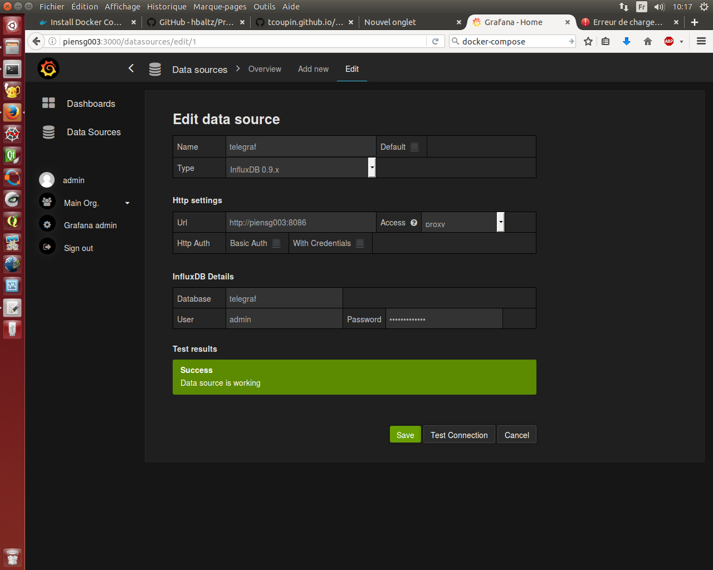
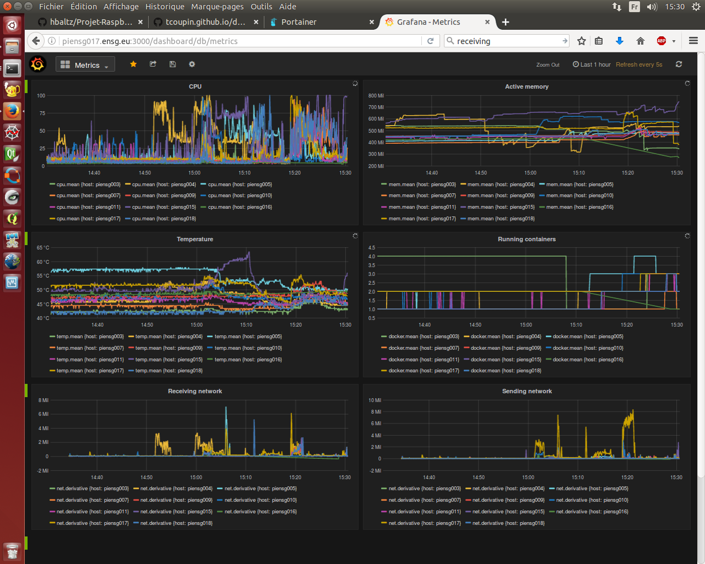

# Métriques Hardware #

## Description ##

Nous nous intéressons à des métriques concernant les RPI : le CPU du système et l'utilisation du CPU, la mémoire, le réseau, la température ...

## Lien avec les autres composants ##

Les autres composants vont utiliser de la mémoire, du réseau ou d'autres besoins physiques. Ce sont ces informations-ci que nous allons observer au cours du temps.

## Documentation ##
### Solution utilisée ##

Récupération du Tp de TCoupin : .../tp_asi_ensg/examples/03-system-probe

Il est composé d'un fichier docker-compose.yaml utilisant :
- Grafana pour l'affichage
- Influxdb pour sauver les métriques
- Telegraph pour les récupérer

### Composition du docker-compose sur ordinateur ###

```yml
grafana:
  image: grafana/grafana:4.1.1-1484211277
  volumes:
    - grafana-config:/etc/grafana
    - grafana-data:/var/lib/grafana
    - grafana-log:/var/log/grafana
  ports:
    - "3000:3000"
  links:
    - influxdb
influxdb:
  image: influxdb:1.2.0-alpine
  volumes:
    - influxdb-data:/var/lib/influxdb
telegraf:
  build: telegraf
  links:
    - influxdb
```
'build' fait appel au dossier telegraf contenant un Dockerfile et un fichier de configuration de telegraf appelé dans le Dockerfile.

Grafana et Telegraf sont reliés à Influxbd pour communiquer les métriques.

### Adaptation sur un ordinateur ###

Ajout des ports pour influxBD :
- 8083 : Visualisation
- 8086 : Data

### Adaptation sur un RPI ###

Passage au ARM :  
Il faut utiliser des images faites pour les RPI et compatibles.  
Nous pouvons les chercher dans hub.docker.com ou créer les rpi-images dont nous avons besoin.

Nous avons :  
*grafana/grafana:4.1.1-1484211277* devient *dilgerm/rpi-grafana:2.6.0*  
*influxdb:1.2.0-alpine* devient *hypriot/rpi-influxdb:1.1.1*   
*telegraf:1.2.0-alpine* devient *tcoupin/rpi-telegraf:1.2.1*  

### Composition du docker-compose sur RPI ###
```yml
  influxdb:
    image: hypriot/rpi-influxdb:1.1.1
    volumes:
      - influxdb-data:/data
    ports:
      - "8086:8086"
    environment:
      ADMIN_USER: admin
      INFLUXDB_INIT_PWD: superpassword
      PRE_CREATE_DB: telegraf
  grafana:
    image: dilgerm/rpi-grafana:2.6.0
    ports:
      - "3000:3000"
    volumes:
      - grafana-data:/grafan/data
      - grafana-config:/grafana/config
    links:
      - influxdb
  telegraf:
    image: tcoupin/rpi-telegraf:1.2.1
    volumes:
      - telegraf-config:/etc/telegraf
    network_mode: host
```

### Déploiement ###

Il faut mettre en place Telegraf sur chaque RPI mais centraliser InfluxDB et Grafana.
Il faut diviser le docker-compose en deux.

Lorsque les volumes seront gérés, il faudra changer les volumes dans les docker-compose pour partager les données.

Utiliser un fichier conf pour telegraf pour tous les RPI et le déployer manuellement.

Une fois que tout fonctionne, il faut ajouter les images à registry. Puis déployer les images de registry.

Exemple pour influxdb :
```
docker tag hypriot/rpi-influxdb:1.1.1 piensg017.ensg.eu:5000/influxdb:1.1.1
docker push piensg017.ensg.eu:5000/telegraf:1.2.1

docker run -it --rm piensg017.ensg.eu:5000/telegraf:1.2.1 telegraf config > telegraf.conf

cd /mnt/Data/telegraf/
nano telegraf.conf
```

### Utilisation de Grafana ###
#### Configuration de 'Data Source' ####
Se connecter en tant qu'admin sur piensg003 (ou piensg017.ensg.eu si dans le registry) puis ajouter data source comme :  


#### Ajout d'un 'Dashboard' ####
Pour visualiser aller sur New Dashboard, ajouter new puis :


#### Exemple ####
Création du dashboard :



## Vulnérabilités ##

Influxdb est un service qui se lance sur un seul noeud du swarm.
Pas de multi-déploiement d'Influxdb donc si le noeud vient à tomber, le service Influxdb est inaccessible le temps qu'il se redéploie sur un autre noeud.

## Difficultés rencontrées ##

Versions des images sur les RPI et les configurations
