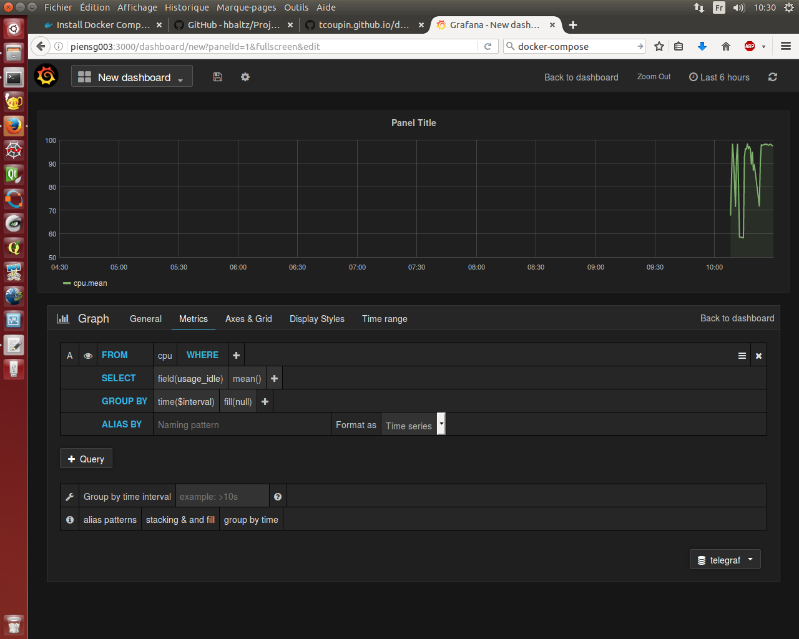

# Métrique Hardware #

Nous nous intéressons à des métriques concernant le CPU : le CPU du système et l'utilisation du CPU, la mémoire, le réseau...

Idées :
</br>https://www.datadoghq.com/blog/how-to-monitor-docker-resource-metrics/
</br>http://docs.datadoghq.com/integrations/docker/
</br>https://hub.docker.com/_/docker/


## Solution utilisée ##

Récupération du Tp de TCoupin : .../tp_asi_ensg/examples/03-system-probe

Il est composé d'un fichier docker-compose.yaml utilisant :
- Gafana pour l'affichage
- Influxdb pour sauver les métriques
- Telegraph pour les récupérer

### Composition du docker-compose sur ordi ###
```
grafana:
  image: grafana/grafana:4.1.1-1484211277
  volumes:
    - grafana-config:/etc/grafana
    - grafana-data:/var/lib/grafana
    - grafana-log:/var/log/grafana
  ports:
    - "3000:3000"
  links:
    - influxdb
influxdb:
  image: influxdb:1.2.0-alpine
  volumes:
    - influxdb-data:/var/lib/influxdb
telegraf:
  build: telegraf
  links:
    - influxdb
```
'build' fait appelle au dossier telegraf contenant un Dockerfile et un fichier de configuration de telegraf appelé dans le Dockerfile.

Grafana et Telegraf sont reliés à Influxbd pour communiquer.

### Utilisation du docker-compose ###
```
docker-compose up -d
```

### Adaptation sur un ordi ###
Ajout des ports pour influxBD
8083 : Visu
8086 : Data

### Adaptation sur un RPI ###
Passage au ARM
Il faut utiliser des images faites pour les RPI et compatible.
Nous pouvons les chercher dans hub.docker.com ou les créer les rpi-images dont nous avons besoin.

</br>grafana/grafana:4.1.1-1484211277 devient dilgerm/rpi-grafana:2.6.0
</br>influxdb:1.2.0-alpine devient hypriot/rpi-influxdb:1.1.1
</br>telegraf:1.2.0-alpine devient tcoupin/rpi-telegraf:1.2.1

### Composition du docker-compose sur RPI ###
```
  influxdb:
    image: hypriot/rpi-influxdb:1.1.1
    volumes:
      - influxdb-data:/data
    ports:
      - "8086:8086"
    environment:
      ADMIN_USER: admin
      INFLUXDB_INIT_PWD: superpassword
      PRE_CREATE_DB: telegraf
  grafana:
    image: dilgerm/rpi-grafana:2.6.0
    ports:
      - "3000:3000"
    volumes:
      - grafana-data:/grafan/data
      - grafana-config:/grafana/config
    links:
      - influxdb
  telegraf:
    image: tcoupin/rpi-telegraf:1.2.1
    volumes:
      - telegraf-config:/etc/telegraf
    network_mode: host
```

### Déploiement ###

Il faut mettre en place Telegraf sur chaque RPI mais centraliser InfluxDB et Grafana.
Il faut diviser le docker-compose en deux.

Lorsque les volumes seront gérés, il faudra changer les volumes dans les docker-compose pour partager les données.

Utiliser un fichier conf pour telegraf pour tous les RPI et le déployer manuellement.

Une fois que tout fonctionne, il faut ajouter les images à registry. Puis déployer les images de registry.

Exemple pour influxdb : 
```sh
docker tag hypriot/rpi-influxdb:1.1.1 piensg017.ensg.eu:5000/influxdb:1.1.1
docker push piensg017.ensg.eu:5000/telegraf:1.2.1


docker run -it --rm piensg017.ensg.eu:5000/telegraf:1.2.1 telegraf config > telegraf.conf

cd /mnt/Data/telegraf/
nano telegraf.conf 
```

### Utilisation de Grafana ###

En allant sur piensg003 (ou piensg017.ensg.eu si dans le registry), connecter avec admin puis ajouter data source comme : 


Pour visualiser aller sur New Dashboard, ajouter new puis : 



Création du dashboard : 


### Vulnérabilité ###

Pas de déploiement d'Influxdb

### Trucs et astuces ###
- Supprimer tous les conteneurs
```
docker rm $(docker ps -a -q) -f
```
- Supprimer toutes les images
```
docker rmi $(docker images -q) -f
```
- Version du docker-compose
```
docker-compose --version
```
si 1.9 -> docker-compose { version: 2.0 }

- Copie d'un dossier d'un ordi sur RPI:
</br>dans /tmp et IP rpi : 172.31.57.62
```
scp -r ./*  pirate@172.31.57.62:/tmp
```
- Copie d'un dossier d'un RPI sur un ordi:
</br>dans /home/prof/Bureau/Docker-raspberry et IP ordi : 172.31.57.136
```
scp -r ./* prof@172.31.57.136:/home/prof/Bureau/Docker-raspberry
```
