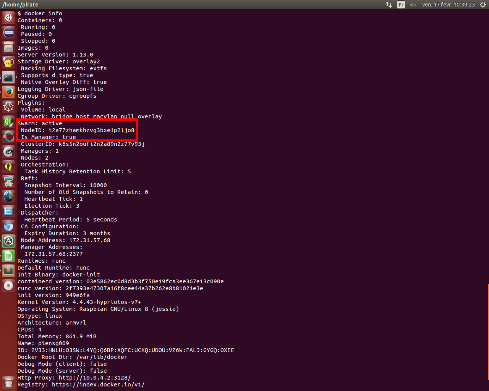
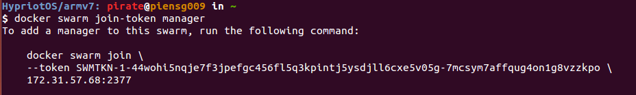
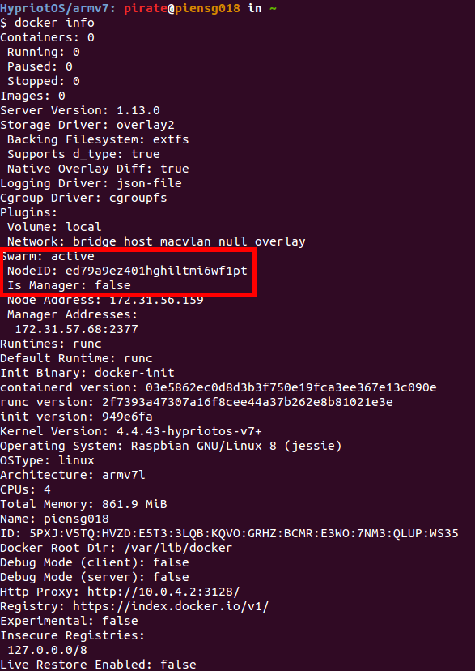
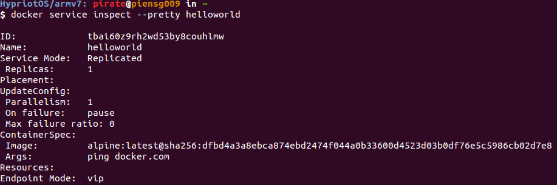
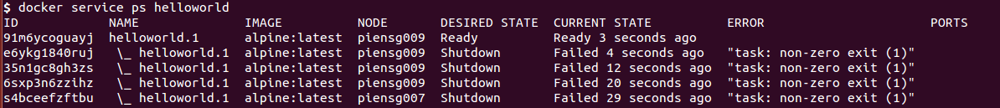

# Swarm tutorial

After a swarm initialisation, we can see :

This is our manager !

Then, we have to generate the token to join our swarm.
- generate token as manager

- generate token as worker

Once we have the token, we could add a node by joining the swarm :

Now, we can see our new node is well a worker (because it is not a manager) :

Here is the list of all the nodes. We can see our manager (piensg009) and the worker we added (piensg018) :

> This information is accessible from manager only.
Exemple from a worker : 

Then we can create a new service on our swarm :

and check which services are running :

To read more details about this service, we can inspect it :

We can also see on which node this service is running :

If we start a webserver (port 80) on the swarm, we can access to it on the browser, like this [httpd docker image](https://github.com/hypriot/rpi-busybox-httpd) :

